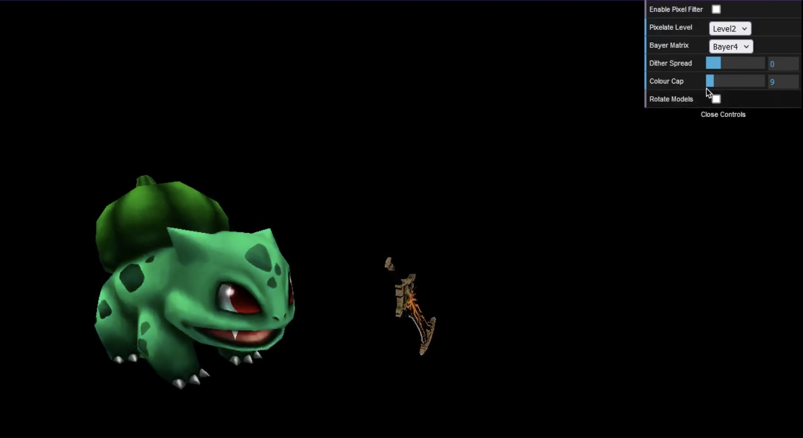
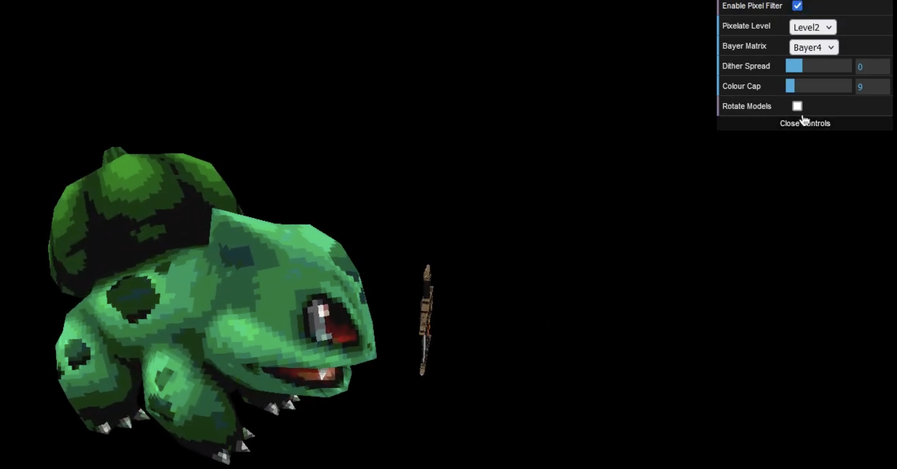
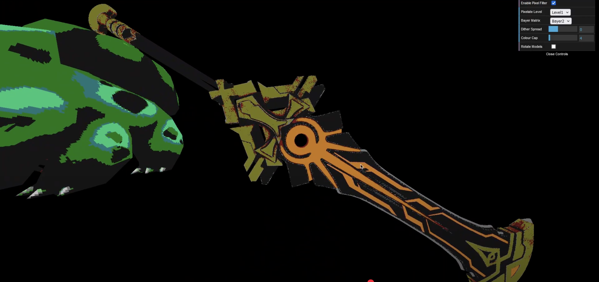

This project utilises the GLSL shader language to implement pixelisation on model textures.

Features include: 

* Adjustable Dithering Levels
* Adjustable Bayer Matrix Density
* Colour limiting

Examples: 

Model Pre-Pixelation:

Model Post-Pixelation:

Model with Colours Capped:

Demonstration: https://www.youtube.com/watch?v=uBavz5a42Dk
